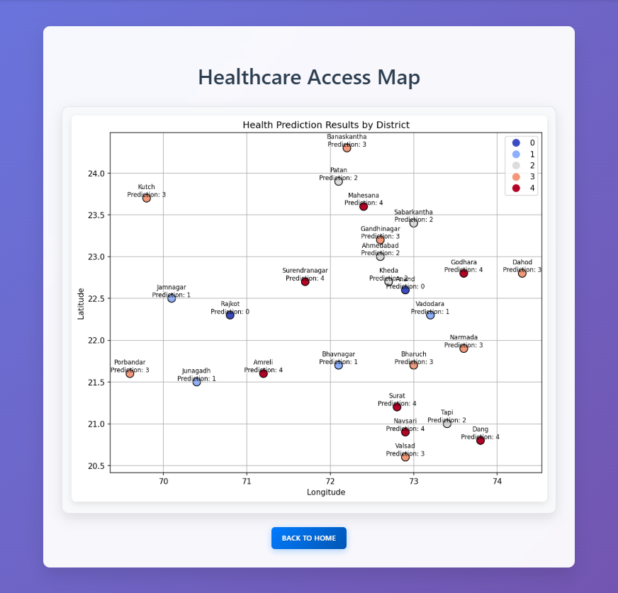

# EQUIHEALTH - ALTERNATE VERSION

Alternate version of [Equihealth](https://github.com/MaheshR03/equihealth)

The alternate version uses matplotlib instead of plotly to visualize health disparity data.

### Installation

1. **Clone the repository**
   ```bash
   git clone https://github.com/MaheshR03/equihealth-alternate.git
   cd equihealth
   ```

2. **Install dependencies**
   ```bash
   pip install -r requirements.txt
   ```

3. **Run the application**
   ```bash
   python app.py
   ```

4. **Access the platform**
   Open your browser and navigate to `http://localhost:5000`

---

### SNAPSHOT


